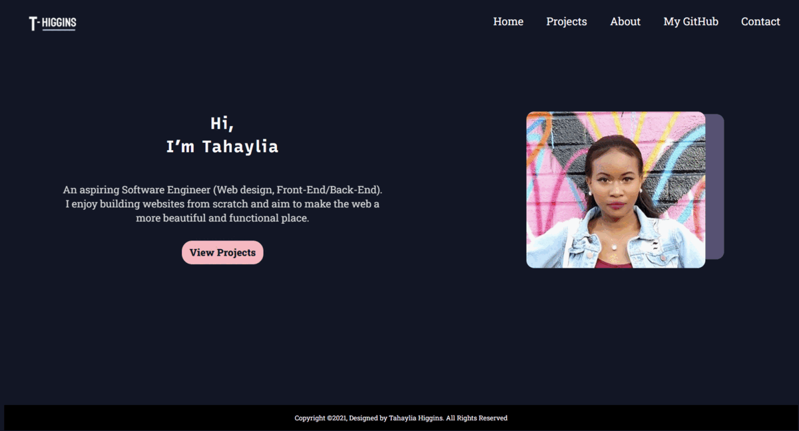

# My Portfolio

  

<h2>Overview</h2>

This portfolio website was designed and developed to showcase my current projects. It was thoughtfully developed with enthusiasm.
 

<h2>Live Link here:</h2> 
<a href="https://th876.github.io/Portfolio/">My Portfolio</a>

<h2>Features:</h2> 
<ul>
  <li>Brief introduction of developer on homepage with a "View Projects" button.</li>
  <li>Simple, clean right-aligned menu system that changes color when users hover over it.</li>
  <li>Projects page.</li>
  <li>About me page.</li>
  <li>Contact form page that directs users to a thank you page upon submission.</li>
</ul>

<h2>Dependency:</h2>
<ul>
  <li>Font from <a href="https://fonts.google.com/">Google Fonts</a></li>
  <li>Name logo and favicon created using <a href="https://www.adobe.com/products/photoshop.html?sdid=KKQIN&mv=search&kw=photoshop&ef_id=Cj0KCQjw4v2EBhCtARIsACan3nzWa02yHOxxhoA2qyth0Ccx23VW6QLSgtmysrlXsdK-F58df6NXpr0aAmSXEALw_wcB:G:s&s_kwcid=AL!3085!3!442365419729!e!!g!!adobe%20photoshop%20home&gclid=Cj0KCQjw4v2EBhCtARIsACan3nzWa02yHOxxhoA2qyth0Ccx23VW6QLSgtmysrlXsdK-F58df6NXpr0aAmSXEALw_wcB">Adobe Photoshop</a></li> 
  <li>Icons from <a href="https://www.freepik.com/">Freepik</a></li>
</ul>
